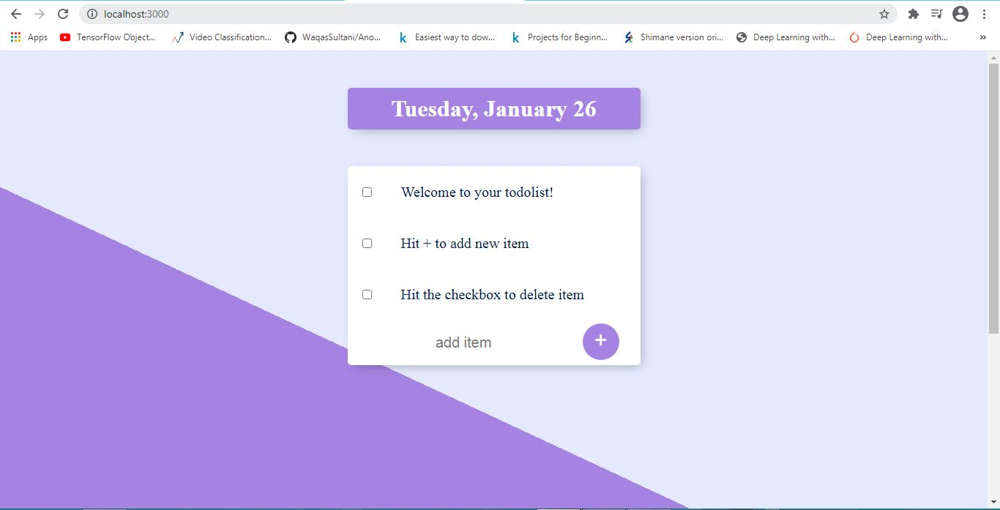

# Todo list
This is a simple Todo list web application created with [Express](https://expressjs.com/), [Node.JS](https://nodejs.org/en/) and [MongoDB](https://www.mongodb.com/). This project was created when I was taking the course [**The Complete 2021 Web Development Bootcamp**](https://www.udemy.com/course/the-complete-web-development-bootcamp/).
The project will look as:

## How to start it

`npm i`

To install all the dependencies then 

`node app.js`

To host it locally, the website will be at http://localhost:3000/
